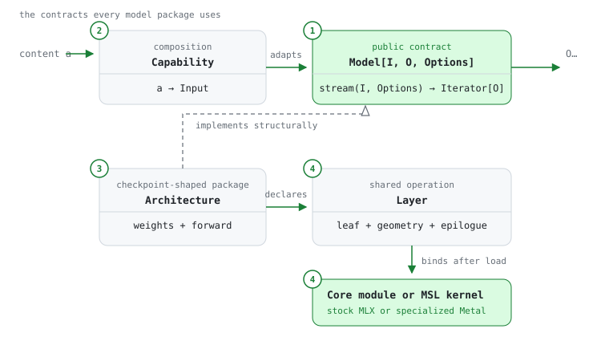
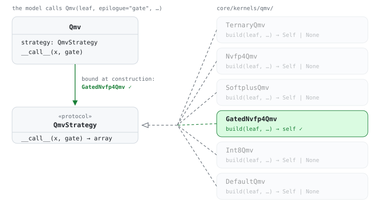
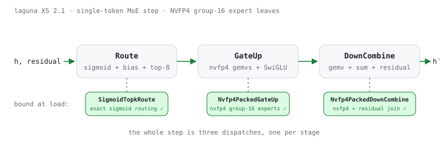

<p align="center">
  
</p>

<p align="center">
  <a href="https://pypi.org/project/mlx-omnia/"></a>
  <a href="https://pypi.org/project/mlx-omnia/"></a>
  <a href="https://github.com/gabfssilva/mlx-omnia/blob/main/LICENSE"></a>
</p>

> **Work in progress.** APIs, model coverage, and internals change without notice.

mlx-omnia is an open-source inference engine for Apple Silicon. It is written in Python and [Metal Shading Language](https://developer.apple.com/metal/Metal-Shading-Language-Specification.pdf) on top of [MLX](https://github.com/ml-explore/mlx). Models run locally through a Python library, a command-line client, a macOS menu bar app, or APIs compatible with OpenAI, Anthropic and Gemini.

Running a model depends on MLX alone. The engine supports around 45 architecture families and handles checkpoint downloads and quantization. Performance work targets the machine's physical limit, subject to measured numerical accuracy and code that remains maintainable.

## Installation

Everything below needs an Apple Silicon Mac. One distribution ships every component; extras select which ones to install.

### Engine

```sh
pip install mlx-omnia
```

`load` is the only entry point, and it takes a Hugging Face repository or a local checkout:

```python
from mlx_omnia import Chat, ChatMessage, GenerationOptions, load

model = load("Qwen/Qwen3-4B")
question: ChatMessage = {"role": "user", "content": "Explain KV caching in two sentences."}

for piece in model.stream(Chat((question,)), GenerationOptions(max_tokens=512)):
    print(piece.text, end="", flush=True)
```

### Server

```sh
pip install "mlx-omnia[server]"
omnia-server
```

The server listens on `127.0.0.1:8642`, and `--host` and `--port` move it. Point an OpenAI SDK at `http://127.0.0.1:8642/api/openai/v1`, an Anthropic client at `/api/anthropic/v1` and a Gemini client at `/api/gemini/v1beta`.

### CLI

```sh
pip install "mlx-omnia[cli]"
omnia chat
```

The CLI speaks HTTP, so it needs a server. Use `--url` to point it at a remote one. Besides `chat`, it provides `omnia run` for a single prompt on stdout, `omnia models list` for models on disk and in memory, and `omnia status` for the daemon and its host.

Installing `mlx-omnia[all]` gives you the server and the CLI at once.

### macOS app

The app is not published yet, so it is built from the checkout with [mise](https://mise.jdx.dev) and [uv](https://docs.astral.sh/uv/):

```sh
git clone https://github.com/gabfssilva/mlx-omnia
cd mlx-omnia
mise run app
```

The SwiftUI menu bar panel provides chat and model management over the same HTTP API. It starts the server when nothing answers on the configured port. From that checkout, `mise run sync` installs the extras omitted by a bare `uv sync`.

## How it works

The ideas everything below rests on — prefill and decode, the KV cache, expert routing, quantization formats, why decode is bound by memory bandwidth — are developed in [a ten-chapter series under `docs/`](docs/00-intro.md) that reads like a short book. This section only needs the four abstractions the codebase is built around. Each one exists because a specific coupling would otherwise creep in, so each is stated here as the problem it removes:

1. **Model.** Without a contract, loading, scheduling and serving would branch on the architecture, and every new family would touch all three. So every model declares a signature — which input types it accepts, what it produces, which generation options it takes — and everything model-agnostic works from the signature alone. A language model streams text; an embedding model returns a vector in a stream of length one.
2. **Capability.** A new modality should not rewrite the model that already works. A capability is an adapter on the input side of a `Model`: the image tower shipped today converts pixels into rows the text trunk already accepts, so the trunk keeps its interface and never sees a pixel. Another modality composes the same way without changing the model behind it.
3. **Architecture.** Two families that look alike today diverge later, and a shared modeling layer would force them to diverge together. So each checkpoint family is one self-contained package whose module tree mirrors the checkpoint: property names are the checkpoint's own, and strict loading is the totality contract. Inside it:
   - **Tokenizer.** The family's own tokenizer. Byte-level BPE comes from the engine; a family with another scheme, such as Gemma's SentencePiece-style BPE, ships its own.
   - **Specific layers.** The blocks that make the family what it is: its attention, its MoE block, its normalization placement. They compose the shared layers below and never select an implementation.
4. **Layer.** Decode is [memory-bandwidth-bound](docs/07-performance.md), so how a weight is stored decides which arithmetic can run at the hardware's limit — but the model should not know that. Architectures therefore declare shared arithmetic — `Route`, `GateUp`, `DownCombine` and the like — and each declaration binds one implementation once the checkpoint is loaded and weight formats are final:
   - **Core modules.** Stock MLX implementations. They always build, accept every valid declaration and serve as the numerical reference.
   - **[MSL kernels](docs/08-kernels.md).** Specialized Metal implementations. One binds only when it computes exactly the declared arithmetic; every declared property participates in that decision.

The numbers mark where each abstraction sits:

<p align="center">
  
</p>

When a layer resolves its implementation, it hands each candidate everything that affects the result: the weight with its [quantization format](docs/06-quantization.md), the geometry and the operation that follows. A candidate accepts only when it computes exactly what was declared; an NVFP4 weight (a 4-bit floating-point group format) feeding a [gated projection](docs/04-ffn-moe.md) binds the kernel written for that exact combination, and the core module accepts whatever remains. The strictness is the point: a kernel that almost matches would silently run another model's arithmetic and still produce plausible text, so declining is the safety mechanism.

<p align="center">
  
</p>

You do not need to know what `Nvfp4Qmv` or `SoftplusQmv` do in detail; what matters is that they are the same function optimized for different contexts. mlx-omnia has two jobs here: let a developer define custom implementations of an operation, as well as define the selection rules for a loaded checkpoint.

This is what makes the engine flexible without a modeling framework in the middle. Qwen3 MoE and Laguna XS 2.1 declare the same three operations for their expert MLPs — [routing, then the two halves of the expert projection](docs/04-ffn-moe.md) — and the declarations are identical; the checkpoint decides the rest. Qwen3's 4-bit affine weights bind the affine kernels, Laguna's NVFP4 experts and sigmoid routing bind the set below, and the single-token step is [three GPU dispatches](docs/08-kernels.md) either way.

<p align="center">
  
</p>

## The book

`docs/` holds the long-form explanation: ten chapters, each taking one primitive that appears across architectures and answering what problem it solves, what the naive form is, what the code actually does and what breaks if you get it wrong. Start at the [introduction](docs/00-intro.md); if you only want to know why decode is slow, the short path is 01 → 02 → 07.

| | | |
| --- | --- | --- |
| [01](docs/01-foundations.md) | Foundations | tokens, the decoder stack, prefill and decode |
| [02](docs/02-attention.md) | Attention | heads, masks, and the KV cache |
| [03](docs/03-positional.md) | Position | RoPE and what happens past the trained context |
| [04](docs/04-ffn-moe.md) | FFN and MoE | SwiGLU, routing, conditional compute |
| [05](docs/05-linear-state.md) | Linear state | recurrent mixers and hybrid trunks |
| [06](docs/06-quantization.md) | Quantization | group formats, packing, mixed precision |
| [07](docs/07-performance.md) | Performance | the bandwidth ceiling and how a number is earned |
| [08](docs/08-kernels.md) | Kernels | when a Metal kernel pays, and what fusing costs |
| [09](docs/09-serving.md) | Serving | residency, queueing, prefix reuse, jobs |

## Contributing

The distribution contains four sibling packages. `mlx_omnia` only re-exports the engine's public API; none of the four contains the others.

| module | what it does |
| --- | --- |
| `mlx_omnia.engine` | Holds the model packages, the checkpoint loading, the generation pipeline, the Metal kernels and the quantization. |
| `mlx_omnia.server` | A FastAPI server that speaks the OpenAI, Anthropic and Gemini APIs, streaming included, behind a global FCFS queue. |
| `mlx_omnia.cli` | An HTTP client for the server. It depends only on httpx. |
| `mlx_omnia.bench` | The measurement instrument (`omnia-bench`). It runs a thermal gate, teacher forcing and interleaved rounds, and prints a dominance verdict — [chapter 07](docs/07-performance.md) explains each of those and why a number without them does not count. It is engine-agnostic, and omnia and mlx-lm are optional adapters under it. |

Keeping them as siblings is what makes the boundaries checkable, because `lint-imports` can then forbid the harness a single name, `mlx_omnia.engine`, which covers whatever the engine grows next.

The app lives separately in `app/` as a SwiftUI menu bar panel with its own SwiftPM package. It reaches the daemon over HTTP like any other client, which allows it to use another language.

Inside the engine:

```
src/mlx_omnia/engine/
  model.py              the contract: signature, content types, composed capabilities
  models/<family>/      one self-contained package per architecture family
  checkpoint.py         the load spine; each architecture declares a CHECKPOINT
  task.py               `load` is the only entry point; it dispatches on model_type
  language.py           the language task: prompt, tokenizer, generation options
  generate.py           model-agnostic decode pipeline
  bpe.py                byte-level BPE tokenizer
  quant/                quantization: formats, plans, calibration
  core/                 architecture-agnostic infrastructure (cache, rope, masks, kernels/)
```

These are the design rules that keep it in this shape:

- **Each architecture family gets one self-contained, checkpoint-shaped package.** The property names are the checkpoint's own, so the module tree is the shape table and strict loading is the totality contract. Nothing renames anything along the way.
- **Families share no modeling layer.** It is fine for two of them to repeat an attention shape, because a shared abstraction couples architectures that will diverge later. Code only moves to `core/` on the second byte-identical use.
- **Loading has a single door.** `mlx_omnia.load` reads `model_type` and dispatches to that architecture's `CHECKPOINT`, and there is no public per-architecture loader.
- **Protocols sit at the boundary.** Model-agnostic code depends on a `Protocol` sized to what it actually calls, and that protocol is defined where it is consumed. Models satisfy it structurally and never import the consumer.
- **Layering is strict and one-directional**, and import-linter contracts and `uv tree` enforce it. The server knows only the engine's public API, while the CLI and the app speak HTTP and nothing else.
- **Kernels are named after operations and never after models.** They live in `core/kernels/` and export a cheap `*_applies(...)` predicate, so the model decides when a kernel applies to it and the kernel never knows the model exists.
- **Typing is strict and has no escape hatches.** pyright runs in strict mode at zero errors, and stale upstream stubs get corrected in `core/mxcompat.py` instead of silenced with `# type: ignore`.

You run the suite and the rest of the gate like this:

```sh
uv run pytest -q                                             # suite
uv run ruff check && uv run pyright && uv run lint-imports   # rest of the gate
```

Fixtures are generated from reference implementations (`tests/fixtures/generate_*.py`) and are not checked in, while `SHA256SUMS` is. Parity tests compare full logits against those fixtures, with tolerances derived from measured noise floors.

Benchmarks run interleaved A/B in the same process, behind a thermal gate. `omnia-bench interleaved` compares against a baseline engine, and `omnia-bench paired` compares the working tree against a git ref.

## Acknowledgements

- [MLX](https://github.com/ml-explore/mlx) is the array framework everything here runs on.
- [mlx-lm](https://github.com/ml-explore/mlx-lm) is the numerical reference and the benchmark baseline for large checkpoints.
- [PyTorch](https://github.com/pytorch/pytorch) and [transformers](https://github.com/huggingface/transformers) are the authoritative reference implementations that every port is validated against.
- [llama.cpp](https://github.com/ggml-org/llama.cpp), [vLLM](https://github.com/vllm-project/vllm), [oMLX](https://github.com/jundot/omlx) and [LM Studio](https://lmstudio.ai)'s mlx-engine were studied for ports and server-side ideas.

## License

MIT
